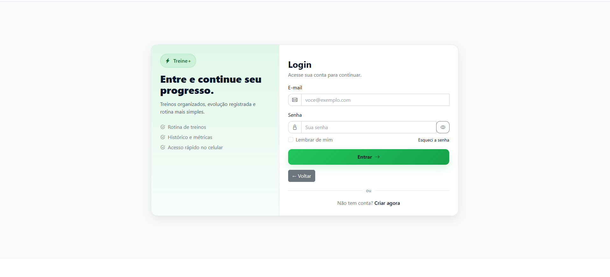
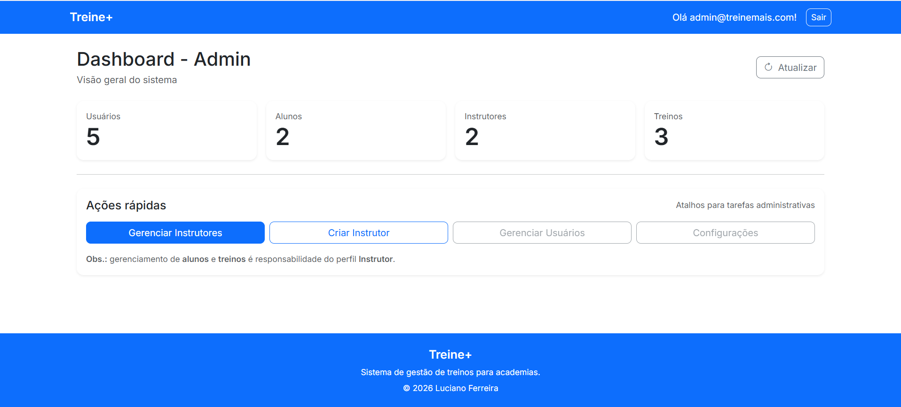
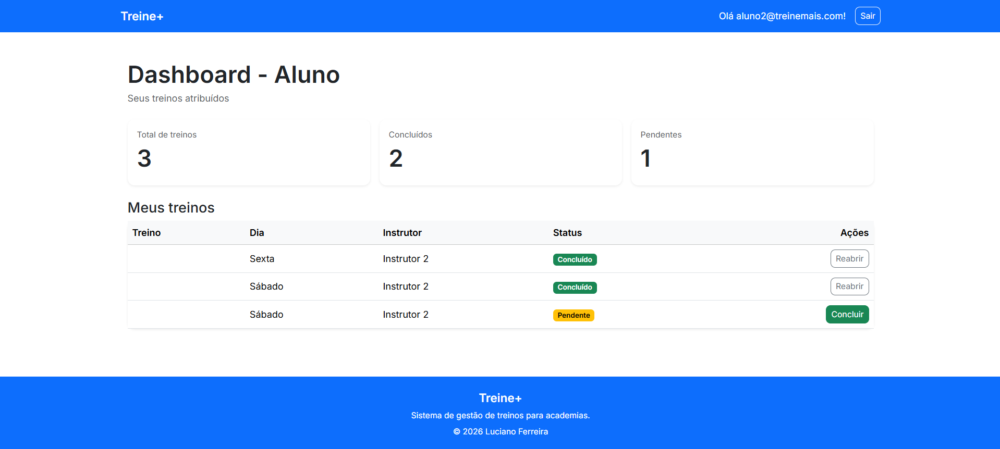
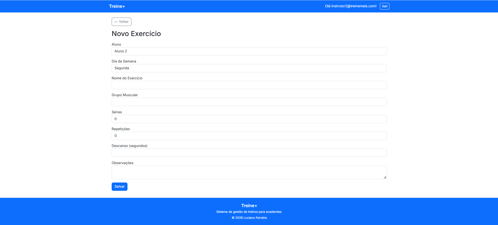
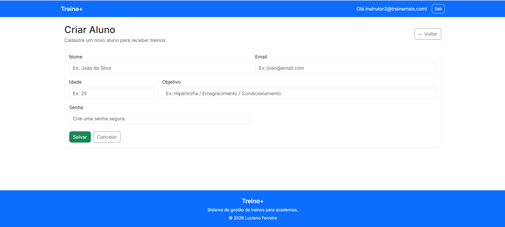

# 💪 Treine+ (TreineMais)


Sistema web para academias e personal trainers gerenciarem treinos personalizados de alunos.

Projeto desenvolvido como **MVP (Minimum Viable Product)** utilizando **ASP.NET Core MVC** e **SQL Server**, com autenticação baseada em **Identity**.

🌐 Sistema online:  
https://treinemais.lucianoferreiradev.com

# 🏗 Arquitetura

O projeto segue uma arquitetura baseada em **camadas**, separando responsabilidades entre:

- **Controllers** → controle das requisições HTTP
- **Services (futuro)** → regras de negócio
- **Models / Entities** → representação das entidades do sistema
- **ViewModels** → comunicação entre Controller e View
- **Views (Razor)** → interface do usuário

O acesso a dados é realizado através do **Entity Framework Core**, utilizando o padrão **Code First com Migrations**.

---

# 🚀 Tecnologias Utilizadas

Backend
- .NET 8
- ASP.NET Core MVC
- Entity Framework Core
- ASP.NET Identity

Banco de Dados
- SQL Server

Frontend
- Razor Views
- Bootstrap 5

Infraestrutura
- Linux VPS
- Nginx
- Docker

---

# 🎯 Objetivo do Projeto

Permitir que **instrutores** criem e gerenciem treinos personalizados para seus alunos, enquanto os **alunos acompanham seus treinos e marcam exercícios como concluídos.**

O projeto foi desenvolvido com foco em:

- arquitetura simples
- autenticação segura
- fluxo claro de usuário
- base preparada para evolução futura

---

# 👥 Perfis de Usuário

## 👨‍🏫 Instrutor

Pode:

- cadastrar alunos
- criar treinos
- atribuir treinos por dia da semana
- gerenciar alunos

## 👨‍🎓 Aluno

Pode:

- visualizar seus treinos
- acompanhar progresso
- marcar treinos como concluídos

---

## 🔐 Usuários de Teste

Para facilitar a avaliação do sistema, foram criados três perfis de usuário.

### 👑 Admin
Responsável pela visão administrativa do sistema.

Email: admin@treinemais.com  
Senha: Admin@123


### 👨‍🏫 Instrutor
Pode cadastrar alunos e criar treinos personalizados.

Email: instrutor@treinemais.com  
Senha: Instrutor@123


### 👨‍🎓 Aluno
Pode visualizar seus treinos e marcar exercícios como concluídos.

Email: aluno@treinemais.com  
Senha: Aluno@123
---

# 🧱 Funcionalidades do MVP

- Autenticação com ASP.NET Identity
- Controle de acesso por perfil (Admin / Instrutor / Aluno)
- Cadastro e gerenciamento de alunos
- Criação de treinos personalizados
- Cadastro de exercícios
- Visualização de treinos pelos alunos
- Marcação de exercícios concluídos
- Interface responsiva 

---

# 🗂 Estrutura do Projeto

```text
TreineMais
│
├── Controllers
│ ├── AdminController.cs
│ ├── DashboardController.cs
│ ├── ExerciciosController.cs
│ ├── HomeController.cs
│ ├── RedirectController.cs
│ └── TreinosController.cs
│
├── Data
│ ├── AppDbContext.cs
│ ├── IdentitySeed.cs
│ └── Migrations
│
├── Models
│ ├── ApplicationUser.cs
│ ├── ErrorViewModel.cs
│ ├── Exercicio.cs
│ ├── Treino.cs
│ └── TreinoExercicio.cs
│
├── ViewModels
│
├── Views
│
├── Areas
│ └── Identity
│ └── Pages
│ └── Account
│
├── Properties
│
└── Program.cs
```

---

# ⚙️ Como Rodar o Projeto Localmente

### 1️⃣ Clone o repositório

git clone https://github.com/LucianoSF1992/TreineMais.git

### 2️⃣ Entre na pasta do projeto

cd treinemais

### 3️⃣ Configure a connection string

Arquivo:

appsettings.json

Configure para seu SQL Server local.

---

### 4️⃣ Execute as migrations

dotnet ef database update

---

### 5️⃣ Rode o projeto

dotnet run


---

# 🗄 Banco de Dados

Banco utilizado:

**SQL Server**

Gerenciado por:

**Entity Framework Core**

Principais entidades:

- ApplicationUser
- Treino
- Exercicio
- TreinoExercicio

---

# 🚀 Deploy

O sistema está hospedado em uma **VPS Linux** configurada manualmente.

Infraestrutura utilizada:

- **Ubuntu Server**
- **Nginx** (Reverse Proxy)
- **.NET Runtime**
- **SQL Server em container Docker**
- **Certificado SSL (Let's Encrypt)**

Arquitetura de deploy:

Internet
↓
Nginx (Reverse Proxy)
↓
ASP.NET Core (Kestrel)
↓
SQL Server

---

# 📸 Screenshots

### Login



### Dashboard - Admin



### Dashboard - Aluno



### Criar Treino



### Criar Aluno




# 🔮 Próximas Evoluções

- Histórico de treinos
- Gráficos de desempenho
- Upload de vídeos de exercícios
- API REST com JWT
- Aplicativo mobile (MAUI ou React Native)
- Área administrativa completa

---

# 👨‍💻 Autor

Luciano Ferreira  
Desenvolvedor Full Stack .NET

🌐 Portfólio  
https://lucianoferreiradev.com

💼 LinkedIn  
https://www.linkedin.com/in/lucianoferreira92/

💻 GitHub  
https://github.com/LucianoSF1992